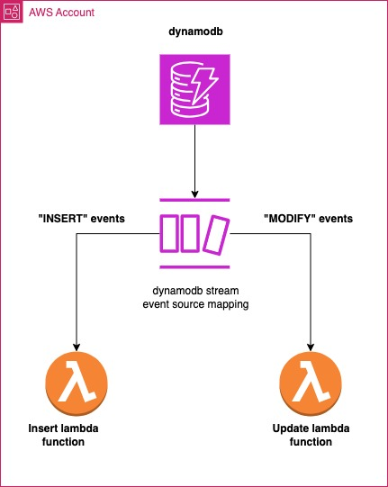
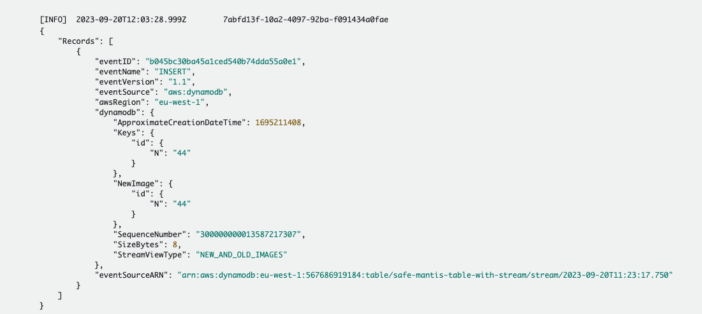
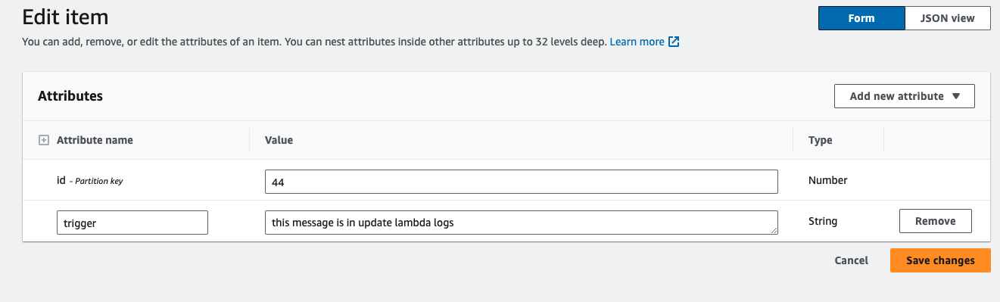
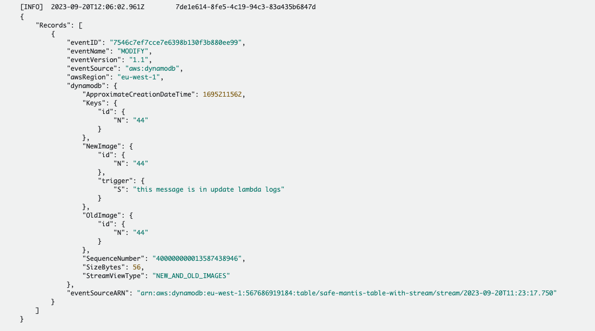

# Terraform DynamoDB with Lambda Stream Example

This repository demonstrates how to use Terraform to create an AWS DynamoDB table with a stream that triggers two Lambda functions. The first Lambda function handles `INSERT` events, while the second Lambda function handles `MODIFY` events.

<p align="center">
  
</p>

## Prerequisites

- [Terraform](https://www.terraform.io/downloads.html) installed.
- AWS CLI configured with appropriate permissions.
- [Node.js](https://nodejs.org/) installed (for Lambda functions).

## Setup

1. **Clone the Repository**

   ```bash
   git clone https://github.com/KBoudich/dynamodb-stream-esmap-lambda.git
   cd dynamodb-stream-esmap-lambda
   ```

2. **Initialize Terraform**
   ```bash
    terraform init
   ```
3. **Apply Terraform configuration**

   ```bash
    terraform apply
   ```

This will set up the DynamoDB table, the stream, and the two Lambda functions.

4. **Test**

   4.1 **Add an titem to table**

   Add an Item in the dynamodb

```bash
aws dynamodb put-item --table-name <table-name-placeholder> --item "{\"id\": {\"N\": \"44\"}}"

```

<p align="center">
  
</p>

The screenshot above show the insert lambda log after receiving the insert event

4.2 **Update the item**

Updade the Item in the dynamodb

<p align="center">
  
</p>

Few moments after updating the Item, we can see in the update lambda functions log, the update event with the Item payload.

<p align="center">
  
</p>

## Architecture

DynamoDB Table: Stores your data and has a stream enabled.

DynamoDB Stream: Captures data modifications in the DynamoDB table.

Lambda Function 1: Triggered by INSERT events from the DynamoDB stream. Written in Python.

Lambda Function 2: Triggered by MODIFY events from the DynamoDB stream. Written in Python.

## Lambda Functions

insert-handler: This Python function processes INSERT events. You can find the code in the lambda/insert.py file.

modify-handler: This Python function processes MODIFY events. You can find the code in the lambda/update.py file.

## Cleanup

To destroy the resources created by Terraform:

```bash
terraform destroy
```

## Contributing

Feel free to submit pull requests or raise issues if you find any.

## License

This project is licensed under the MIT License.
